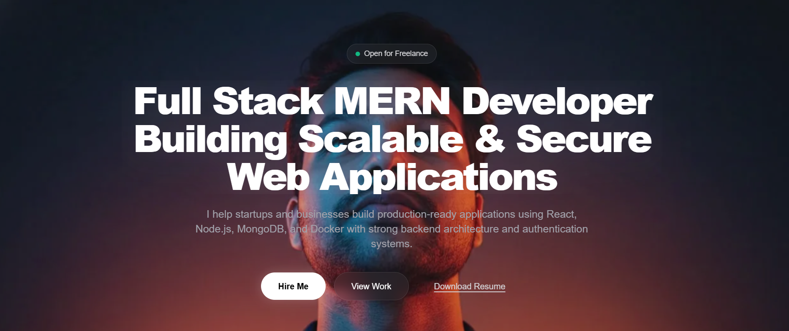

<div align="center">
  

  <h1>Aryan Raghav - Professional Portfolio</h1>
  
  <p>A high-performance, scrollytelling personal portfolio built specifically to showcase production-grade MERN stack engineering, systems design, and UI/UX capabilities.</p>

  <p>
    <a href="https://nextjs.org/"></a>
    <a href="https://www.typescriptlang.org/"></a>
    <a href="https://tailwindcss.com/"></a>
    <a href="https://www.framer.com/motion/"></a>
  </p>
</div>

## 🚀 Features

- **Cinematic Scrollytelling Engine**: An HTML5 Canvas implementation that scrubs through a 120-frame image sequence linked natively to the user's scroll position for an immersive "Awwwards-style" experience.
- **Parallax Typography**: Scroll-linked staggered text animations driven by Framer Motion.
- **Glassmorphic UI**: High-fidelity translucent components, deep backdrop blurs, and premium dark-mode aesthetics.
- **Case Studies**: Detailed technical breakdowns of real-world projects, highlighting problem-solution dynamics over basic project links.
- **Zero-Auth Functional Contact**: Direct-to-inbox messaging integration using FormSubmit without requiring heavy backend mailer setups.
- **Fully Responsive**: Flawless execution across ultra-wide monitors down to standard mobile viewports.

## 🛠️ Tech Stack

- **Framework**: [Next.js 14](https://nextjs.org/) (App Router format)
- **Language**: [TypeScript](https://www.typescriptlang.org/)
- **Styling**: [Tailwind CSS](https://tailwindcss.com/)
- **Animation**: [Framer Motion](https://www.framer.com/motion/)
- **Icons**: [Lucide React](https://lucide.dev/)
- **Core Mechanic**: HTML5 `<canvas>` rendering engine

## 📂 Project Structure

```text
src/
├── app/
│   ├── globals.css      # Core theme mapping
│   ├── layout.tsx       # Root document structure
│   └── page.tsx         # Main portfolio assembly
├── components/
│   ├── Contact.tsx      # Zero-auth email form & socials
│   ├── Footer.tsx       # Standard closing footprint
│   ├── Overlay.tsx      # Scroll-linked hero typography
│   ├── Projects.tsx     # Technical case studies
│   ├── ScrollyCanvas.tsx# Canvas-based sequence renderer
│   ├── Services.tsx     # Core development offerings
│   └── WhyMe.tsx        # Statistical engineering merits
```

## 💻 Local Development

1. Clone the repository
```bash
git clone https://github.com/ctrlcoded/Aryan-portfolio.git
```

2. Navigate into the directory
```bash
cd Aryan-portfolio
```

3. Install dependencies
```bash
npm install
```

4. Start the development server
```bash
npm run dev
```

5. Open [http://localhost:3000](http://localhost:3000) in your browser to view the application.

<hr>
<div align="center">
  <p>Made with ❤️ by Aryan Raghav</p>
  <p><a href="https://github.com/ctrlcoded">GitHub</a> • <a href="https://www.linkedin.com/in/aryan-raghav-96407b252/">LinkedIn</a> • <a href="mailto:delhibhanu2@gmail.com">Email</a></p>
</div>
